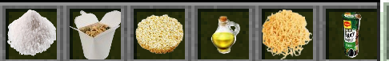
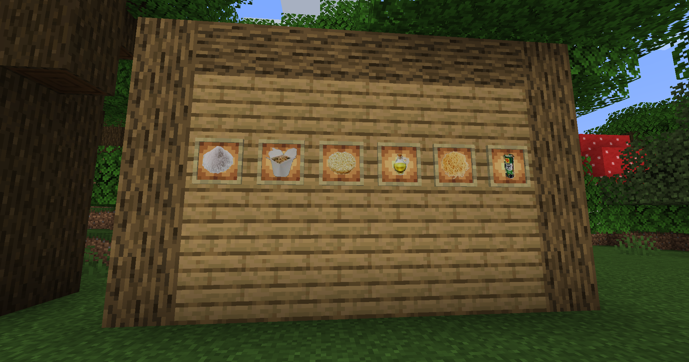
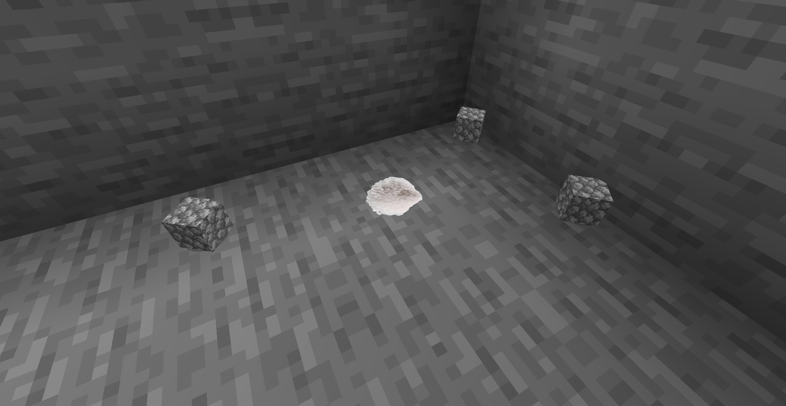
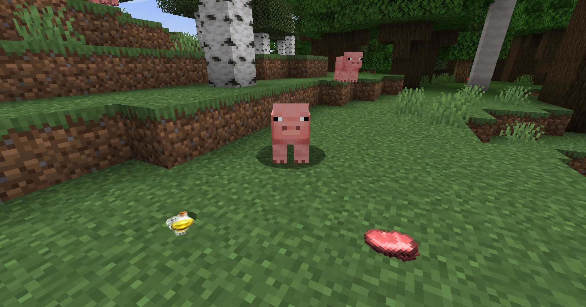
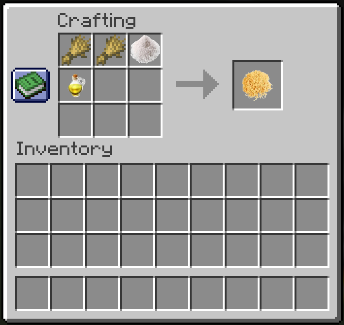
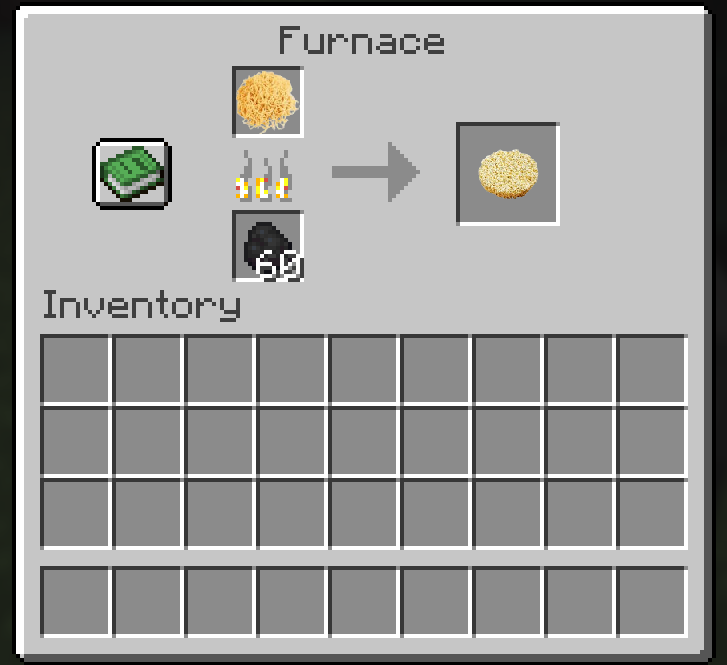
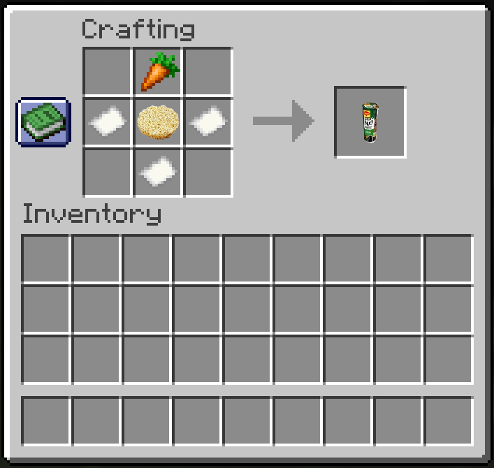
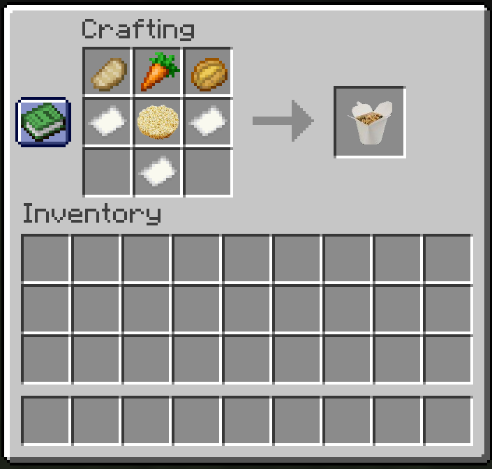

# Teriyaki Noodles
Teriyaki Noodles for minecraft (java edition) 1.21, built with fabric.

## How to build/install/use?
Open terminal and run:
```bash
$ git clone https://github.com/barnii77/mc_teriyaki_noodles
$ cd mc_teriyaki_noodles
$ gradlew build
```

Copy jar file from `build/libs/` and put it in your mods folder or load using feather client or whatever.
**ENJOY!**

# Features
- Salt (5% chance to get from clean stone)
- Pig Fat (25% chance to get from pig)
- Raw Noodles (2 * wheat + salt + pig fat)
- Fried Noodles (raw noodles + oven)
- Teriyaki Noodles (3 * paper + fried noodles + carrot)
- XXL Teriyaki Noodles (3 * paper + fried noodles + carrot + grilled porkchop + baked potato)

# Screenshots









# Credits
Thanks to BastiM129 for the cool screenshots!
[GitHub](https://github.com/BastiM129)